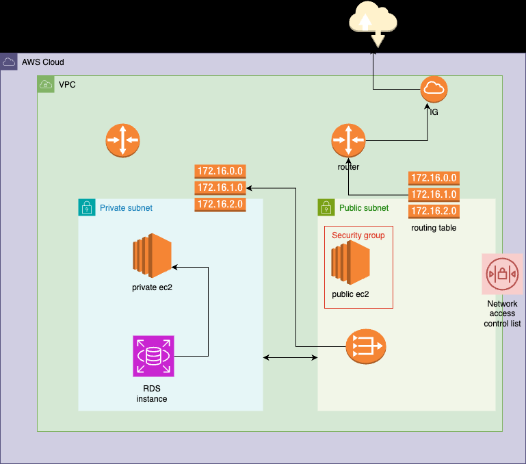

# 3-tier-Infrastructure-On-AWS-With-Terraform
3-tier-Infrastructure-On-AWS-With-Terraform

# Architechture

# What did I  do? — Implementation Explanation
I wil set up two EC2 instances: one in a public subnet with a public IP for internet access, and another in a private subnet without direct internet connectivity.

To enable software updates for the private instance, I will implement a NAT gateway in the public subnet with an Elastic IP. I will configure routes to allow the private instance to communicate through the NAT gateway.

Additionally, I will create an RDS instance running Postgres in the private subnet, accessible only from the private EC2 instance. This setup ensures a secure environment with controlled internet access and database isolation.

# Step 1: Set Up Your Networking
- Create a new VPC with CIDR block(10.0.0.0/16)
- Create a private and public subnet and respective routing tables.
- Create an Internet Gateway and associate it with VPC. Create a public route to allow internet access to your public subnet.
- Create a NAT gateway in your public subnet and a private route allowing outbound internet access to your private subnet via the public subnet.

# Step 2: Set Up the Database Layer
- Create an Amazon RDS instance for your database in the private subnet.
- Configure the database security group to allow connections only from the application layer(EC2 instance on your private subnet).

# Step 3: Set Up the Application and web Layer
- Create an EC2 instance in your private subnet for the application layer. This will not have a public IP, you can only access it from the web layer.
-Create an EC2 instance in your public subnet for the web layer. This VM will have a public IP, allowing connection from the internet.
-Ensure that the security group allows traffic from the Web layer and to the Database layer.

# Step 4: Configure Security Groups and Network ACLs
- Set up security groups to control inbound and outbound traffic at the instance level for both the application and web layer.
- Configure Network Access Control Lists (ACLs) to control inbound and outbound traffic at the subnet level.

# Step 5: Testing Your Setup
- Access your web server through its public IP address or domain name.
- Check the connectivity between the layers by trying to access the application layers from the web layer, and the database layer from the application level.
